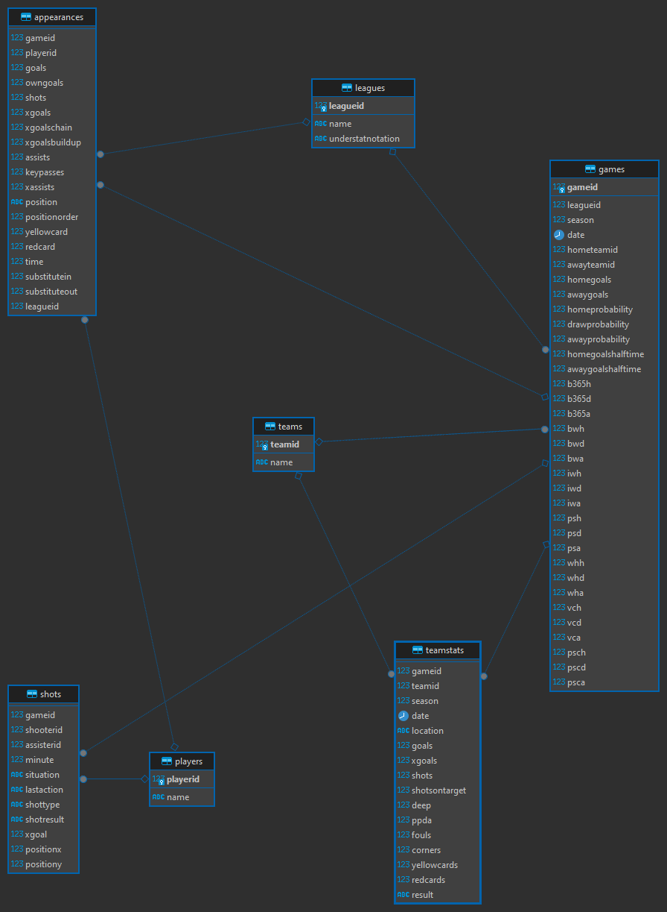

# Proyecto_BDD
## Proyecto de base de datos 1. Analisis de es investigar los datos presentados para responder a la siguiente
pregunta: Basado en el desempeño de los equipos y jugadores según este modelo, ¿a qué
equipo le apostaría usted? (debe de dar fundamentos basados en los datos)

